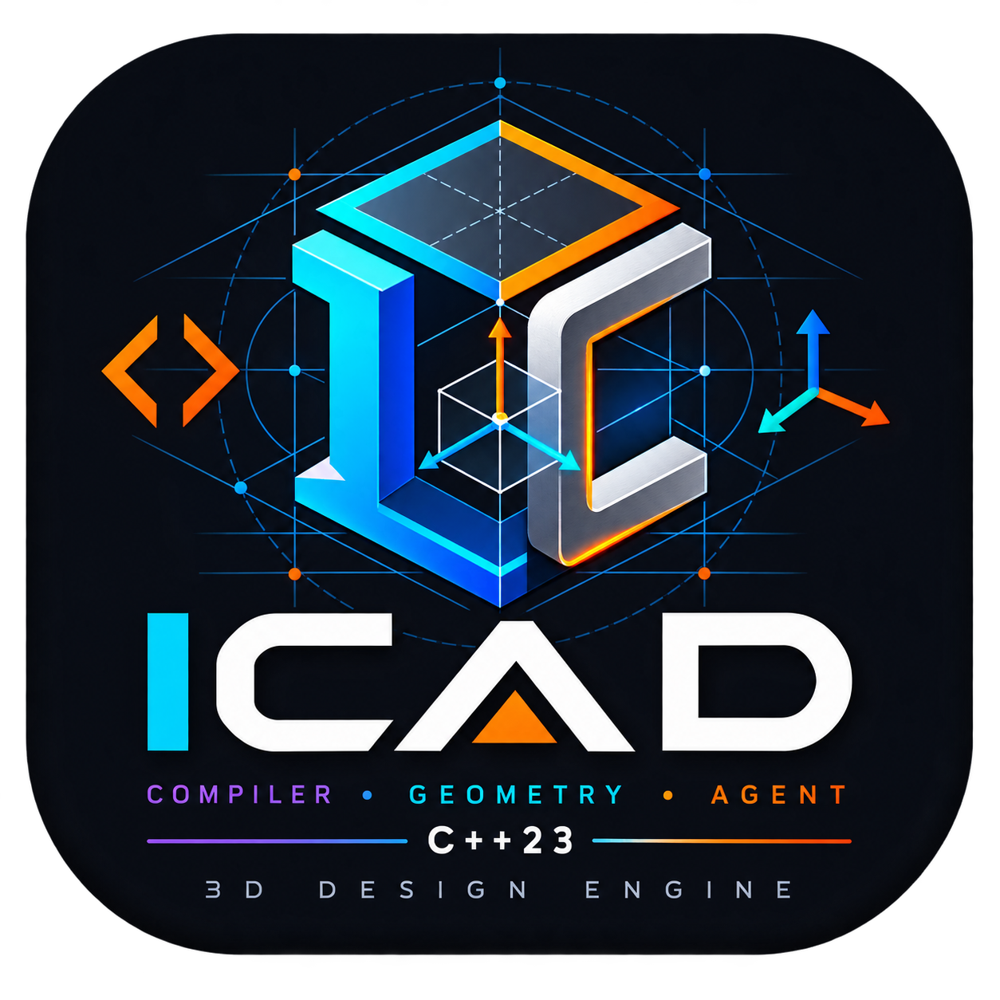

<p align="center">
  
</p>

# ICAD

ICAD is an independent C++23 compiler and geometry engine for agentic 3D
design. A person or AI agent writes a deterministic `.icad` program; ICAD
checks it, lowers it to a canonical model, resolves spatial points, vectors,
body poses and mechanism joints, builds geometry, applies predefined materials,
compiles animation scenes, and emits CAD, mesh, scene, and browser viewer
artifacts.

ICAD does not use an external CAD kernel. Its lexer, parser, type
system, diagnostics, semantic IR, primitive geometry, native boolean CSG,
transforms, analytic and faceted topology, triangulation, STEP writer, OBJ
writer, material system, and web
viewer are owned by this repository. This is a deliberate product rule: the
engine is designed around auditable AI-agent workflows instead of wrapping a
desktop CAD API.

ICAD is available under the [MIT License](LICENSE).

Tagged releases are built by GitHub Actions for Linux, Windows, Intel macOS,
Apple Silicon macOS, and VS Code. See [the release guide](docs/releasing.md).

## Quick start

Requirements are intentionally small:

- CMake 3.25+
- Clang or another C++23 compiler
- Make (optional convenience wrapper)

The optional desktop host uses pinned `webview/webview` 0.12.0 and the platform
web engine (WebKit on macOS, WebKitGTK on Linux, WebView2 on Windows). It is not
a compiler-core dependency.

On macOS, Apple Clang works. clangd is recommended for IntelliSense.

```sh
make
make test
make benchmark
make advanced
make viewer
```

Create the maintained detailed robotic-arm design and its complete artifact
package directly from one short prompt:

```sh
build/bin/icad agent-create \
  "Create a detailed articulated industrial robotic arm with a gripper and animated joints" \
  --source-out build/agent/robotic_arm.icad \
  --output-dir build/agent/robotic_arm
```

This one command classifies the design intent, selects an embedded
compiler-validated parametric template, runs the composite engineering review,
writes editable `.icad` source, and exports every format. Its result also gives
the calling model explicit assumptions, named parameter/angle handles, overall
and per-body bounds, named spatial references, the parent-child joint graph,
contacts, and animation tracks—enough to form a compact spatial picture without
reverse-engineering mesh triangles. Recognized robotic-arm and bridge prompts
target one model iteration; unfamiliar prompts receive a valid generic
parametric starter for agent refinement.

Open [`build/examples/advanced.html`](build/examples/advanced.html) directly in
a browser. It needs no server, package install, or framework. Drag to orbit,
scroll to zoom, and use Play/Pause for the compiled animation.

The advanced build produces:

```text
build/examples/advanced.step        analytic/faceted solid CAD exchange
build/examples/advanced.assembly.step hierarchical component exchange
build/examples/advanced.obj         named triangle mesh
build/examples/advanced.stl         portable triangle mesh
build/examples/advanced.gltf        embedded-buffer glTF 2.0 scene mesh
build/examples/advanced.glb         binary glTF 2.0 scene mesh
build/examples/advanced.3mf         OPC-packaged 3MF manufacturing mesh
build/examples/advanced.scene.json  materials, embedded textures, animation
build/examples/advanced.html        zero-setup viewer page
build/examples/advanced.viewer.js   compiled geometry and scene data
build/examples/icad-viewer.js       reusable ICAD browser-viewer library
build/examples/advanced.bom.json    body/component bill of materials
build/examples/advanced.manufacturing.json manufacturing validation
build/examples/advanced.drawing.svg projected native-edge drawing sheet
build/examples/advanced.drawing.dxf real R2013 2D drawing exchange
build/examples/advanced.topology.json stable analytic B-Rep entity map
```

## Compiler commands

```sh
build/bin/icad check examples/advanced.icad
build/bin/icad tokens examples/minimal.icad
build/bin/icad ast examples/minimal.icad
build/bin/icad inspect examples/advanced.icad
build/bin/icad inspect-json examples/advanced.icad
build/bin/icad topology-json examples/advanced.icad
build/bin/icad diagnostics-json examples/advanced.icad
build/bin/icad measure examples/advanced.icad
build/bin/icad interference-json examples/assembly_semantics.icad
build/bin/icad validate examples/advanced.icad
build/bin/icad manufacturing examples/advanced.icad
build/bin/icad materials
build/bin/icad build examples/advanced.icad --output-dir build/examples
build/bin/icad inspect-step build/examples/advanced.step
build/bin/icad inspect-stl build/examples/advanced.stl
build/bin/icad inspect-gltf build/examples/advanced.glb
build/bin/icad inspect-3mf build/examples/advanced.3mf
build/bin/icad inspect-dxf build/examples/advanced.drawing.dxf
build/bin/icad agent-bootstrap "Create an articulated robot arm"
build/bin/icad agent-review examples/robotic_arm.icad
build/bin/icad lsp
build/bin/icad mcp --workspace "$PWD"
```

Commands return non-zero on failure. Diagnostics have stable codes and exact
line/column positions, making them suitable for an agent repair loop.

## Connect any LLM through MCP

`icad mcp` is a native, dependency-free MCP stdio server. It supports the
current stateless `2026-07-28` discovery protocol and the legacy initialize
handshake used by older hosts. Configure any MCP-capable LLM host with:

```json
{
  "mcpServers": {
    "icad": {
      "command": "/absolute/path/to/bin/icad",
      "args": ["mcp", "--workspace", "/absolute/path/to/design-workspace"]
    }
  }
}
```

The deterministic tool catalog contains source-text tools:

- `icad.agent.create`: prompt-to-source, composite review, revisioned commit,
  and complete artifact build in one tool call;
- `icad.agent.bootstrap`: prompt classification, complete maintained source,
  acceptance criteria, and parameter strategy;
- `icad.agent.review`: compilation, constraints, manufacturing, topology,
  metrics, interference, and a compact agent-readable design map in one response;
- `icad.language`: concise source-language and workflow guide;
- `icad.materials`: embedded material and texture metadata;
- `icad.compile`: compiler diagnostics from complete source text;
- `icad.validate`: constraints and manufacturing validation;
- `icad.measure`: area, volume, and bounds;
- `icad.inspect`: canonical IR counts, revision, ownership, and metrics;
- `icad.topology`: stable solid/shell/face/edge/vertex IDs and analytic geometry;
- `icad.distance`: closest points and exact-polyhedral body distance;
- `icad.interference`: penetrating, contained, and surface-contact classification;
- `icad.section`: plane-section segments with body/part provenance;
- `icad.build`: complete staged artifact package.

Durable project tools allow several agents to collaborate without lost edits:

- `icad.project.read`: source plus exact hexadecimal revision;
- `icad.project.write`: validated atomic commit with `expectedRevision`;
- `icad.project.set_parameter`: narrow typed parameter transaction;
- `icad.project.set_parameters`: multiple named dimensions in one validated
  atomic transaction;
- `icad.project.history`: immutable revision inventory;
- `icad.project.restore`: validated historical restore;
- `icad.project.build`: build only the exact expected project revision.

Read-only tools accept source text and return structured JSON plus a text copy
for broad host compatibility. `icad.build` accepts a workspace-relative output
directory, rejects traversal and symlink escapes, and reports every committed
artifact. See [Agent integration](docs/agent-integration.md) for protocol
examples and the provider-independent repair loop.

Use `expectedRevision: "absent"` only when creating a new `.icad` project.
Every later mutation requires the 16-character revision returned by the last
read or commit. A stale agent receives `ICAD-PROJECT-CONFLICT`; invalid source
never replaces the current file. Commits use a cross-process lock, exclusive
temporary file, atomic rename, and immutable snapshots under `.icad-history/`.

## Language basics

ICAD is deliberately line-oriented and token-efficient:

```icad
PROJECT agent_part
UNITS mm

MATERIAL shell CARBON_FIBER

BODY enclosure
MATERIAL shell
FEATURE case
TYPE BOX
WIDTH 100 mm
DEPTH 60 mm
HEIGHT 20 mm
END
END
```

The implemented geometry types are:

- `BOX`: `WIDTH`, `DEPTH`, `HEIGHT`
- `CYLINDER`: `RADIUS`, `HEIGHT`
- `CONE`: `RADIUS1`, `RADIUS2`, `HEIGHT`
- `SPHERE`: `RADIUS`

Large agent-authored designs can be split into deterministic source modules:

```icad
PROJECT factory_cell
UNITS mm
IMPORT "parts/base.icad"
INJECT "generated/gripper.icad"
```

`IMPORT` and the explicit `INJECT` alias insert declarative `.icad` fragments
at that source position. Modules normally omit `PROJECT` and `UNITS`. Resolution
is relative to the importing file, remains inside the entry file's project
directory, accepts only `.icad`, rejects cycles, and enforces depth and total
source-size limits. Imported text is parsed by the same compiler—it never
executes native code, shell commands, or plugins. CLI checks/builds, the LSP,
and live viewer all use this resolver; the viewer also invalidates its cache
when a dependency changes on disk.

Every type accepts `ORIGIN_X`, `ORIGIN_Y`, `ORIGIN_Z`, `ROTATION_X`,
`ROTATION_Y`, and `ROTATION_Z`. Length units are
`mm`, `cm`, `m`, `in`, and `ft`; angles are `deg` and `rad`; scene time units
are `ms`, `s`, and `min`.

Named parameters can replace compatible feature quantities. Custom profiles
support native triangulated extrusion and full revolution:

```icad
PARAMETER thickness 8 mm
PROFILE bracket_section
POINT 0 mm 0 mm
POINT 40 mm 0 mm
POINT 40 mm 20 mm
POINT 0 mm 20 mm
END

BODY bracket
FEATURE plate
TYPE EXTRUDE
PROFILE bracket_section
HEIGHT thickness
END
END
```

Profiles are checked for closure semantics, area, winding, and
self-intersection. Rounded exact profiles use an explicit start, tangent lines,
center-defined circular arcs, and closure:

```icad
PROFILE rounded_plate
START 10 mm 0 mm
LINE 40 mm 0 mm
ARC 50 mm 10 mm CENTER 40 mm 10 mm CCW
LINE 50 mm 20 mm
ARC 40 mm 30 mm CENTER 40 mm 20 mm CCW
LINE 10 mm 30 mm
ARC 0 mm 20 mm CENTER 10 mm 20 mm CCW
LINE 0 mm 10 mm
ARC 10 mm 0 mm CENTER 10 mm 10 mm CCW
CLOSE
END
```

A full circular profile is `CIRCLE center_x center_y radius`, with units on all
three quantities. `EXTRUDE` preserves line and circular-arc edges as analytic
topology while tessellating them deterministically for STL, OBJ, and the web
viewer. `REVOLVE` supports full `360 deg` line, arc, and circle profiles. Curved
revolutions (including torus geometry) use validated faceted topology and
tessellated measurements; line-only revolutions retain analytic topology.
Surface area and volume are evaluated analytically for every current primitive,
curved extrusion, and line-profile revolution instead of being estimated from
STL triangles. Curved-revolution measurements and all world bounds come from
the deterministic delivery mesh.

The owned engine also provides a deterministic sweep-and-prune AABB index plus
segment/plane, ray/triangle, triangle/triangle, and point-in-solid tests.
Triangle results distinguish point, segment, and coplanar overlap.
`interference-json` and `inspect-json` separate penetrating or contained solid
pairs from surface-only contact. Results are honestly labeled polyhedral solid
classification rather than analytic intersection volume.

Features inside a body are evaluated in source order. The first feature is
`NEW` by default; later operands can request native CSG explicitly:

```icad
BODY bracket
FEATURE stock
TYPE BOX
WIDTH 40 mm
DEPTH 30 mm
HEIGHT 10 mm
END
FEATURE opening
TYPE CYLINDER
OPERATION CUT
RADIUS 4 mm
HEIGHT 12 mm
ORIGIN_X 20 mm
ORIGIN_Y 15 mm
ORIGIN_Z -1 mm
END
END
```

`OPERATION UNION`, `CUT`, and `INTERSECT` use ICAD's owned BSP classifier,
vertex welding, conforming boundary splitting, degenerate/duplicate removal,
and connected-solid separation. The result is a validated faceted B-Rep;
primitive operands retain analytic topology only until a boolean consumes
them. `inspect-json` reports operation counts and every applied shape-repair
action. Empty intersections fail with an explicit geometry diagnostic. See
[`examples/boolean_showcase.icad`](examples/boolean_showcase.icad) for the
acceptance model.

Native follow-on modifiers use semantic references instead of triangle IDs:

```icad
POINT3 target_edge 20 mm 10 mm 5 mm
VECTOR row_axis 1 0 0

FEATURE soften
TYPE FILLET
SELECT EDGE NEAREST target_edge
RADIUS 2 mm
END

FEATURE repeat
TYPE LINEAR_PATTERN
DIRECTION row_axis
COUNT 4
SPACING 25 mm
END
```

`CHAMFER` uses `DISTANCE` with the same selector. The deterministic selector
searches all 12 sharp edges of a translated axis-aligned box and resolves ties
by a stable principal-axis order. `FILLET` uses an eight-segment native arc
approximation in the selected edge frame. `LINEAR_PATTERN` accepts 2–1000
instances along a named normalized vector. `MIRROR` uses `PLANE point NORMAL
vector` and retains the source plus its reflected copy. Pattern and mirror
components remain independently named solids; use `UNION` explicitly when one
merged solid is required. Inspection returns each modifier and its selection
provenance. The executable reference is
[`examples/modeling_tools.icad`](examples/modeling_tools.icad).

Named profiles also drive native advanced faceted surfaces:

```icad
FEATURE rail
TYPE SWEEP
PROFILE square
PATH rail_start rail_rise rail_end
END

FEATURE transition
TYPE LOFT
PROFILE square
TARGET_PROFILE inset
HEIGHT 20 mm
END

FEATURE twisted_transition
TYPE FREEFORM
PROFILE square
TARGET_PROFILE diamond
HEIGHT 30 mm
TWIST 90 deg
COUNT 9
END
```

`SWEEP` translates a profile through two or more named 3D path points with a
fixed XY orientation. `LOFT` deterministically resamples and connects two
closed profiles. `FREEFORM` uses the same profile morph with 3–128 sections
and cumulative twist. These outputs and curved full revolutions are validated
faceted B-Reps with tessellated measurements; they are not labeled NURBS or
analytic toroidal surfaces. See
[`examples/advanced_surfaces.icad`](examples/advanced_surfaces.icad).

## Solved dimensional sketches

```icad
SKETCH mounting_outline
POINT origin 0 mm 0 mm FIXED
POINT lower_right 38 mm 2 mm
POINT upper_right 39 mm 28 mm
CONSTRAINT bottom HORIZONTAL origin lower_right
CONSTRAINT right VERTICAL lower_right upper_right
CONSTRAINT width DISTANCE origin lower_right plate_width
CONSTRAINT height DISTANCE lower_right upper_right plate_height
CONSTRAINT corner ANGLE origin lower_right upper_right 90 deg
END
```

The dependency-free solver accepts `HORIZONTAL`, `VERTICAL`, `COINCIDENT`,
`DISTANCE`, and unsigned 0–180° `ANGLE` constraints. Initial point positions
are deterministic solution seeds; `FIXED` coordinates never move. Inspection
reports initial and solved coordinates, maximum residual, iteration count, and
remaining degrees of freedom. A consistent sketch with at least three points
also becomes a closed named profile, so `PROFILE mounting_outline` can directly
drive `EXTRUDE`, `REVOLVE`, `SWEEP`, `LOFT`, or `FREEFORM`. Inconsistent systems
fail compilation with `ICAD-S0038`. See
[`examples/constrained_sketch.icad`](examples/constrained_sketch.icad).

## Dependency graph and incremental compilation

Every canonical project exposes a stable dependency DAG covering parameters,
angles, spatial expressions, sketches, profiles, ordered features, bodies,
constraints, poses, materials, and scenes. `inspect-json` returns each node,
its direct `dependsOn` edges, and deterministic evaluation order. Embedders can
use `icad::compiler::IncrementalCompiler` for a stateful compile session: it
fingerprints each body from its lowered geometry dependencies, reuses unchanged
validated topology, recomputes dirty bodies, and reports reused, recomputed,
and removed body names. Dirty bodies run through a bounded worker pool and are
merged in deterministic source order. A mutex protects each complete cache
revision, so editor, LSP, and agent callers may safely share a compiler.
Project-name changes and `clear()` invalidate the cache.

## Tolerances, distance, and sections

```icad
TOLERANCE LINEAR 0.001 mm ANGULAR 0.01 deg
```

The canonical tolerance policy is unit-checked and included in revision
fingerprints and agent inspection. It drives contact classification and native
query tolerances. `icad distance-json model.icad body_a body_b` returns closest
points and exact Euclidean distance on the same validated polyhedral boundary
used by STEP/STL/OBJ and the viewer. `icad section-json model.icad px py pz nx
ny nz [body]` intersects that boundary with a normalized plane and returns
named segments. Curved source may use a tessellated delivery boundary, so both
JSON contracts state their representation instead of implying analytic-curve
accuracy. See [`examples/geometric_queries.icad`](examples/geometric_queries.icad).

## Agent-readable assemblies and mechanisms

ICAD source can name the spatial quantities that an LLM needs to understand a
mechanism before it looks at triangles:

```icad
PARAMETER shoulder_height 122 mm
ANGLE elbow_angle 55 deg

POINT3 shoulder 0 mm 0 mm shoulder_height
POINT3 elbow 98 mm 0 mm 184 mm
VECTOR hinge_axis 0 1 0
VECTOR tool_axis 1 0 0
VECTOR forearm_axis ROTATE tool_axis AROUND hinge_axis BY elbow_angle
POINT3 tool_tip FROM elbow ALONG tool_axis DISTANCE 140 mm
POINT3 posed_tool_tip FROM elbow ALONG forearm_axis DISTANCE 140 mm
VECTOR reach_axis FROM shoulder TO tool_tip

POSE arm_01 AT shoulder ROTATION 0 deg 0 deg 0 deg

JOINT shoulder_hinge REVOLUTE base arm_01 AT shoulder AXIS hinge_axis VALUE 0 deg LIMIT -90 deg 90 deg
JOINT elbow_hinge REVOLUTE arm_01 arm_02 AT elbow AXIS hinge_axis VALUE elbow_angle LIMIT -135 deg 135 deg
```

Reusable component occurrences use `INSTANCE occurrence OF body AT point
ROTATION X Y Z`. The body remains the shared geometry definition and its base
occurrence; each instance adds a named transformed occurrence without copying
feature source. Joints may connect bodies or instances. For instances, native
fixed/revolute/prismatic parent chains apply driven values around named points
and arbitrary normalized axes to meshes, topology, bounds, STEP/STL/OBJ, and
the viewer. Inspection reports definitions, seed transforms, joint-driven
status, and solved bounds. See
[`examples/assembly_instances.icad`](examples/assembly_instances.icad).

Face and edge mates use world-semantic selectors rather than mesh indices:

```icad
MATE seated FACE base Z_MAX cover Z_MIN OFFSET 0 mm
MATE aligned EDGE base X_AT_Y_MIN_Z_MAX cover X_AT_Y_MIN_Z_MIN TOLERANCE 0.001 mm
```

Face selectors are `X_MIN`, `X_MAX`, `Y_MIN`, `Y_MAX`, `Z_MIN`, and `Z_MAX`.
Edge selectors name the edge direction and fixed sides, for example
`X_AT_Y_MIN_Z_MAX`. Mates validate solved delivery geometry with the project
linear tolerance and block artifact generation when violated. They do not
silently move an occurrence; named points, instance transforms, and joints
remain the explicit assembly pose definition. See
[`examples/assembly_semantics.icad`](examples/assembly_semantics.icad).
Instance occurrences inherit the definition material in manufacturing checks
and appear as separate BOM items with an explicit definition reference.

`POINT3` coordinates and `ANGLE`, `POSE`, joint, or constraint values may
reference a named value with the correct physical dimension. Vectors are
dimensionless and normalized during semantic lowering. Derived points use
`FROM point ALONG vector DISTANCE value`; derived vectors use `FROM point TO
point` or `ROTATE source AROUND axis BY angle`. Axis-angle rotation uses the
right-hand rule. The compiler evaluates mixed point/vector dependencies as a
graph, rejects unknown or cyclic expressions, and preserves each expression in
canonical IR instead of retaining only its numeric result. These forms make
link endpoint and forward-kinematic dependencies explicit without repeating
calculated coordinates. A body may have one explicit world-space
`POSE`; it is applied consistently to meshes, measurements, and exact topology.

Joint types are `FIXED`, `REVOLUTE`, and `PRISMATIC`. Moving joints require a
current `VALUE` and ordered `LIMIT` values. `WORLD` is a valid parent for a
ground joint. The compiler rejects multiple parents, cyclic joint graphs,
unknown bodies/points/axes, dimensional mismatches, and out-of-limit values.
`inspect-json` exposes every resolved value together with its derivation,
per-body bounds/center/size, named cross-body surface and volume contacts, poses, joint
limits, and the mechanism's degree-of-freedom count. An agent can therefore
reason from a spatial expression and adjacency graph instead of inferring
intent from anonymous mesh triangles.

Available constraints are:

- `MIN_DISTANCE body body distance` for world-space body clearance;
- `COINCIDENT point point tolerance` for named anchors;
- `PARALLEL vector vector` and `PERPENDICULAR vector vector` for axes;
- `ANGLE_BETWEEN vector vector angle` for a target direction angle.

A failed constraint or mate prevents artifact generation. Joint values solve
instance occurrence chains; direct definition-body joints remain compatible
metadata, while `POSE` defines a body definition's world arrangement.

## Materials and embedded textures

Declare a named material from a built-in preset, then assign it to a body:

```icad
MATERIAL piers CONCRETE

BODY substructure
MATERIAL piers
# features...
END
```

Built-in presets currently include:

```text
CONCRETE  STRUCTURAL_STEEL  ALUMINUM  ASPHALT  GLASS  WOOD
BRICK     GRANITE           MARBLE    COPPER    BRASS  TITANIUM
CHROME    RUSTED_STEEL      RUBBER    PLASTIC   CARBON_FIBER
CERAMIC   PLASTER           FABRIC    LEATHER   EARTH  GRASS
WATER     ICE               EMISSIVE_WHITE
```

Each preset resolves during semantic compilation to base color, alpha,
metallic, roughness, a stable procedural-texture type, and seed. ICAD generates
a deterministic 32×32 BMP texture and embeds it as a base64 data URI in the
scene. There are no loose texture assets and no image-library dependency.

Typed overrides use a block while keeping a preset as the reproducible base:

```icad
MATERIAL custom_panel
PRESET ALUMINUM
BASE_COLOR 0.12 0.20 0.80 1.0
METALLIC 0.85
ROUGHNESS 0.35
TEXTURE_SCALE 25 mm
UV_MODE BOX
END
```

Color and PBR channels are range checked, texture scale has a physical length,
and UV mode is restricted to `BOX`, `PLANAR`, `CYLINDRICAL`, or `SPHERICAL`.

## Programmable animation scenes

Scenes contain a duration, frame rate, background, and any number of BODY,
CAMERA, or JOINT tracks. Body/camera keyframes store time, position, and XYZ
rotation:

```icad
POINT3 lamp_position 200 mm 150 mm 300 mm
SCENE product_reveal
DURATION 8 s
FPS 30
BACKGROUND STUDIO
LOOP 3
LIGHT key POINT COLOR 1 0.92 0.8 INTENSITY 4 AT lamp_position
EVENT 4 s halfway
TRACK orbit CAMERA main_camera
EASING EASE_IN_OUT
KEYFRAME 0 s POSITION 0 mm 0 mm 0 mm ROTATION 0 deg 0 deg 0 deg
KEYFRAME 8 s POSITION 0 mm 0 mm 0 mm ROTATION 0 deg 0 deg 360 deg
END
TRACK lift BODY enclosure
KEYFRAME 0 s POSITION 0 mm 0 mm 0 mm ROTATION 0 deg 0 deg 0 deg
KEYFRAME 4 s POSITION 0 mm 0 mm 50 mm ROTATION 0 deg 0 deg 0 deg
KEYFRAME 8 s POSITION 0 mm 0 mm 0 mm ROTATION 0 deg 0 deg 0 deg
END
END
```

`VISIBILITY` tracks use `KEYFRAME time VISIBLE ON|OFF`. Easing supports
`LINEAR`, `EASE_IN`, `EASE_OUT`, `EASE_IN_OUT`, and `STEP`; loop counts,
lights, and events are compiler validated and retained in canonical scene IR.

Joint tracks use scalar values in the joint's physical dimension:

```icad
TRACK elbow_motion JOINT elbow_hinge
KEYFRAME 0 s VALUE -45 deg
KEYFRAME 1 s VALUE 70 deg
KEYFRAME 2 s VALUE -45 deg
END
```

The compiler rejects fixed-joint animation and values outside the declared
joint limits. The zero-setup viewer interpolates each value, applies its delta
around the exported solved pivot and axis, and propagates motion through child
occurrences.

The compiler rejects unknown targets, unknown backgrounds, tracks with fewer
than two frames, non-increasing times, and frames outside scene duration.
Canonical values use millimetres, degrees, and seconds.

## Web viewer library

[`web/icad-viewer.js`](web/icad-viewer.js) is a plain JavaScript browser library.
The compiler copies it beside every generated HTML page and emits a local data
script, so `advanced.html` works when opened through `file://`. It renders the
native mesh through a WebGL2 depth-buffered backend, with Canvas fallback. It
supports scene/joint/visibility playback, orbit/zoom, component selection,
centroid measurement, section clipping, assembly explode, an accessible
semantic tree, and responsive pointer/touch controls. It has no npm or CDN
dependency.

The public entry point is:

```js
ICADViewer.mount(document.querySelector("canvas"), window.ICAD_MODEL);
```

To use the native desktop shell:

```sh
make viewer
build/bin/icad-viewer examples/advanced.icad
```

The `webview/webview` desktop shell opens `.icad` source directly as a split
live workbench. The left pane edits the authoritative language source and
shows clickable compiler diagnostics; the right pane retains the last valid
interactive 3D result. A background worker coalesces rapid edits, starts after
a 120 ms debounce, reuses unchanged previews, and rebuilds only dirty body
topology and delivery meshes. The toolbar reports compile time and body reuse.
Save with the button or <kbd>Ctrl</kbd>/<kbd>Cmd</kbd>+<kbd>S</kbd>.

The export bar accepts any writable folder and atomically emits the complete
16-file STEP/assembly STEP/STL/OBJ/glTF/GLB/3MF/viewer/drawing/manufacturing
package from the current editor text; use <kbd>Ctrl</kbd>/<kbd>Cmd</kbd>+<kbd>Shift</kbd>+<kbd>E</kbd>
for the keyboard path. Export runs independently so live editing remains
responsive. On macOS the native host uses a transparent full-content title bar
with ICAD's custom toolbar while retaining standard window controls. Passing an
already compiled `.html` file remains supported for read-only viewing.

## CAD output note

STEP is emitted directly as an ISO 10303-21 AP214 analytic B-Rep using
millimetres. Native topology maps vertices, line/circle curves,
plane/cylinder/cone/sphere surfaces, oriented edge loops, advanced faces,
closed shells, and manifold solids. Faceted native results remain planar
advanced-face B-Reps. `inspect-step` checks the Part 21 envelope, entity
uniqueness, references, closed shells, solid count, and assembly occurrences.
Assembly STEP preserves body/component hierarchy while using flattened
world-space geometry. STL, OBJ, embedded glTF 2.0, binary GLB 2.0, and OPC 3MF
are generated from the same validated delivery model. The drawings module also
emits an R2013 ASCII DXF containing genuine 2D LINE/TEXT entities.

Shapr3D supports STEP for 3D body import, while its DWG/DXF import path is for
2D drawing data. ICAD therefore does not emit a misleading 3D DWG. The current
STEP writer is structurally tested here; final interoperability still needs a
live import in the target CAD version before a release is called certified.

## Agent workflow

1. Start with `icad agent-create` or MCP `icad.agent.create` for the shortest
   prompt-to-artifact path. It embeds maintained compiler-valid robot and bridge
   designs instead of asking a model to rediscover assembly syntax.
2. For a custom topology, call `icad.agent.bootstrap`, edit the returned named
   parameters/vectors/angles, then call `icad.agent.review` once. Repair only
   its focused next actions.
3. Apply dimensional revisions together with `icad.project.set_parameters` so
   one model decision produces one compiler-validated revision.
4. Reference only stable semantic topology IDs returned by ICAD; never patch
   binary CAD or infer a joint axis from mesh triangles.
5. Read back STEP/STL and run the benchmark/viewer gates before delivery.

This keeps every design change diffable and reproducible. `icad lsp` provides
stdio synchronization, diagnostics, completion, definition navigation,
formatting, and safe syntax quick fixes. The packaged extension lives in
`editors/vscode`; it automatically downloads the matching checksum-verified
compiler/viewer release when no workspace build or configured executable is
available. Its Settings page controls LSP, format/check on save, MCP workspace
configuration, agentic helpers, and installation of the bundled Codex plugin.
Tagged GitHub releases attach its VSIX beside native CLI/viewer packages. The
`icad-agentic-cad` Codex plugin installs both
the guided skill and native MCP server. The roadmap in [`PLAN.md`](PLAN.md)
grows the owned engine toward advanced modeling tools, sketch solving, native
joint pose solving, and richer drawings.

## Project completeness

The v0.21 milestone completes the locally testable work packages in the current
plan. The remaining release boundary is external certification: importing the
generated STEP/DXF/3MF packages in named downstream CAD versions and signing
platform binaries. Structural read-back is not mislabeled as that certification.

## Tests and quality gates

```sh
make test              # all unit, transactions, JSON/MCP, CLI, sandbox, and benchmark tests
make test-unit         # compiler, geometry, engineering, agents, scenes
make test-integration  # CLI contracts and diagnostics
make test-sandbox      # clean-working-directory execution
make benchmark         # model corpus plus stateful incremental-reuse case
make quality           # warnings-as-errors and ASan/UBSan
make sanitizers
make thread-sanitizer  # race-check shared incremental compilation, then restore build
```

The configured suite contains 46 deterministic tests: 29 C++ unit/fuzz
executables, integration and sandbox cases, and 12 benchmark cases including a
large robotic-arm live-refresh benchmark. A 47th
headless-Chromium viewer runtime smoke test is registered only when a configure-time
launch probe confirms that the installed browser can actually run headless.

The bridge acceptance model contains 6 parameters, 3 materials, 5 bodies, 35
features, 206 feature properties, 1 scene, 2 tracks, and 5 keyframes. Its
benchmark validates all outputs and reads back 35 STEP solids.
It also locks the analytic topology baseline at 250 vertices, 375 edges, and
195 faces.

The robotic-arm benchmark compares against
`examples/Robotic_Arm_3D_Model`: 10 reference STL component files, 23,314
reference facets, 20 reference STEP solids, and 21 reference assembly
occurrences. The native `robotic_arm.icad` acceptance design builds 10
components, 20 solids, and 1,636 deterministic facets; the primary arm link
uses exact circular profile arcs. This remains a structural
correctness and complexity baseline with 98 exact vertices, 147 exact edges,
and 89 exact faces, not a claim of identical surface shape.

The agentic prompt benchmark runs a single `agent-create` command from a short
robotic-arm request, requires one expected model iteration, verifies 10 bodies,
10 joints, 7 driven degrees of freedom, valid topology, and structurally reads
back the resulting 20-solid STEP assembly. That same test directly validates the
supplied reference folder's 10 STL components and 20-solid STEP baseline before
comparing the generated structural result.

The boolean benchmark evaluates overlapping `UNION`, through `CUT`, and
`INTERSECT` results with a combined volume of 2,840 mm3. It validates repaired
closed-shell topology and reads back three native STEP and STL solids.

The modeling-tools benchmark verifies stable edge selection, fillet, chamfer,
four linear-pattern instances, named-plane mirror, eight validated solids, and
STEP/STL structural read-back.

The advanced-surfaces benchmark verifies named-point polyline sweep,
two-profile loft, a nine-section twisted free-form morph, curved full
revolution, four validated solids, 2,148 facets, and STEP/STL read-back.

The constrained-sketch benchmark solves a parameter-driven rectangle to zero
remaining DOF, converts the result into an extrusion profile, and validates the
solid through STEP/STL structural read-back.

The incremental benchmarks prove full reuse for unchanged input, selective
one-body recomputation in a two-body project, and 8-of-10 delivery-mesh reuse
after a robotic-arm parameter edit. The latter also byte-compares the live
incremental viewer model with a clean full rebuild.

The geometric-query benchmark locks a 0.001 mm policy, an exact 10 mm
polyhedral closest distance, and a tolerance-aware named-body section result.

## Repository layout

```text
ICAD/
├── cmake/                 build policy plus viewer/design source embedding
├── docs/                  architecture notes
├── examples/              executable ICAD designs
├── grammar/               native language EBNF reference
├── include/icad/          public compiler, material, exchange, scene APIs
├── src/
│   ├── compiler/          frontend, resolver, semantic IR
│   ├── cad/               native geometry engine
│   ├── constraints/       geometric clearance validation
│   ├── document/          fingerprints, revisions, BOM export
│   ├── manufacturing/     manufacturability rule reporting
│   ├── drawings/          orthographic SVG output
│   ├── desktop_viewer/    optional webview/webview native host
│   ├── agent/             prompt intent, embedded templates, composite review
│   ├── ai/                stable JSON inspection and diagnostics
│   ├── lsp/               dependency-free stdio diagnostics server
│   ├── mcp/               provider-neutral MCP tool server
│   ├── json/              strict native JSON parser and serializer
│   ├── project/           staged full artifact-package builder
│   ├── materials/         predefined PBR material library
│   ├── exchange/          direct STEP, STL, and OBJ writers
│   ├── scene/             embedded textures and web bundle writer
│   └── cli/               command-line driver
├── web/                   reusable zero-dependency viewer library
├── editors/vscode/        packaged ICAD language extension
├── .github/workflows/     CI and tagged multi-platform releases
├── tests/                 unit, integration, sandbox, benchmark
├── CMakeLists.txt
├── Makefile
└── PLAN.md
```

Manufacturing validation covers extents, wall-thickness proxy, hole diameter,
tool radius, bend and overhang rules, stock bounds, tolerances, and
process/material compatibility. Drawings project actual native mesh edges into
three views and include overall dimensions, datum/tolerance notes, title data,
and BOM count. These are drawing/manufacturing checks, not CAM toolpaths.

## IntelliSense and cleanup

VS Code settings recommend clangd and CMake Tools. `make` generates
`build/compile_commands.json`; `.clangd` uses it for C++23 navigation and
diagnostics. Install the release VSIX with `code --install-extension
build/icad-agentic-cad.vsix` after running the extension package script.

```sh
make help
make clean
make distclean
```
